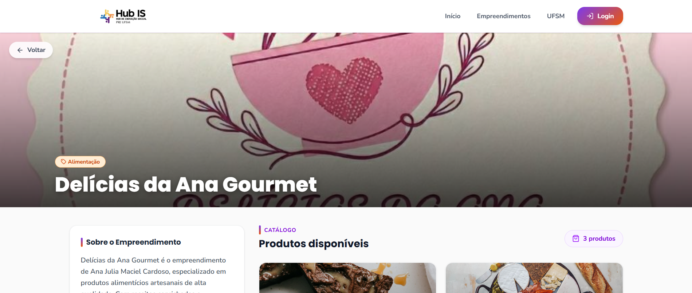
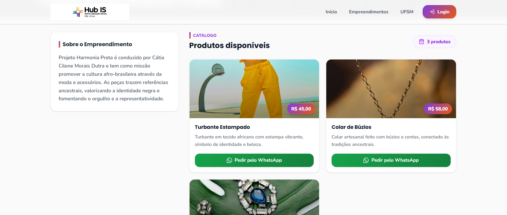
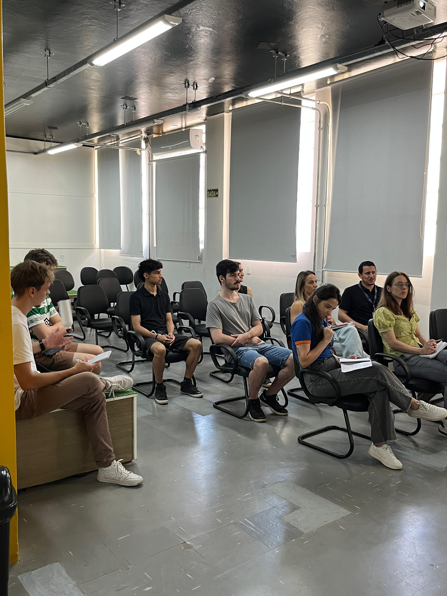
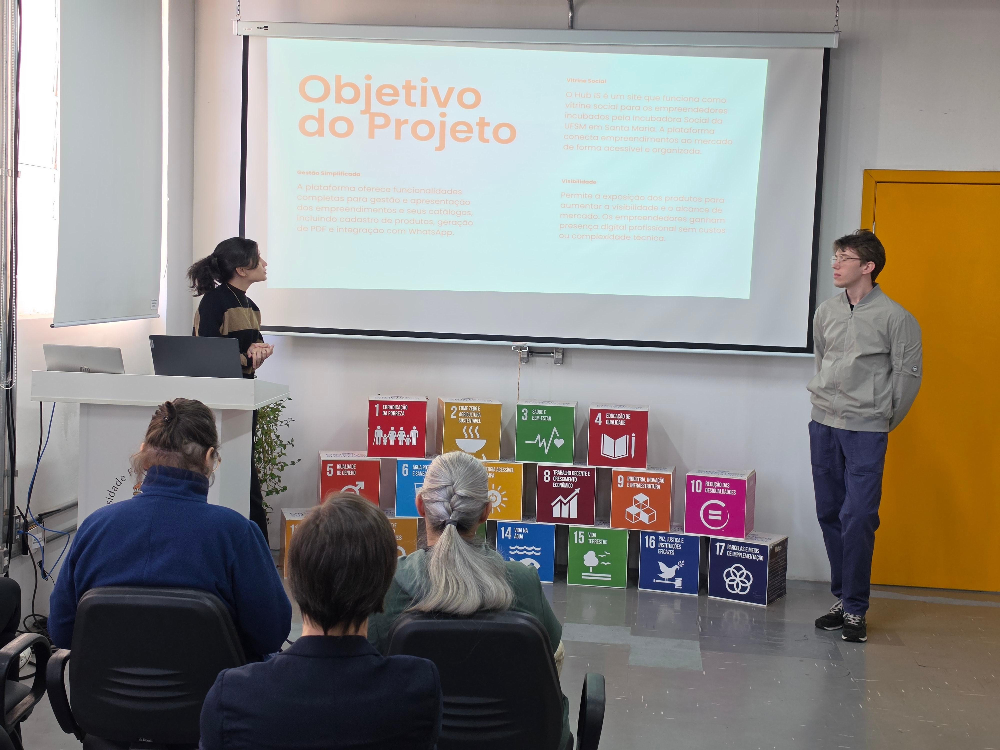
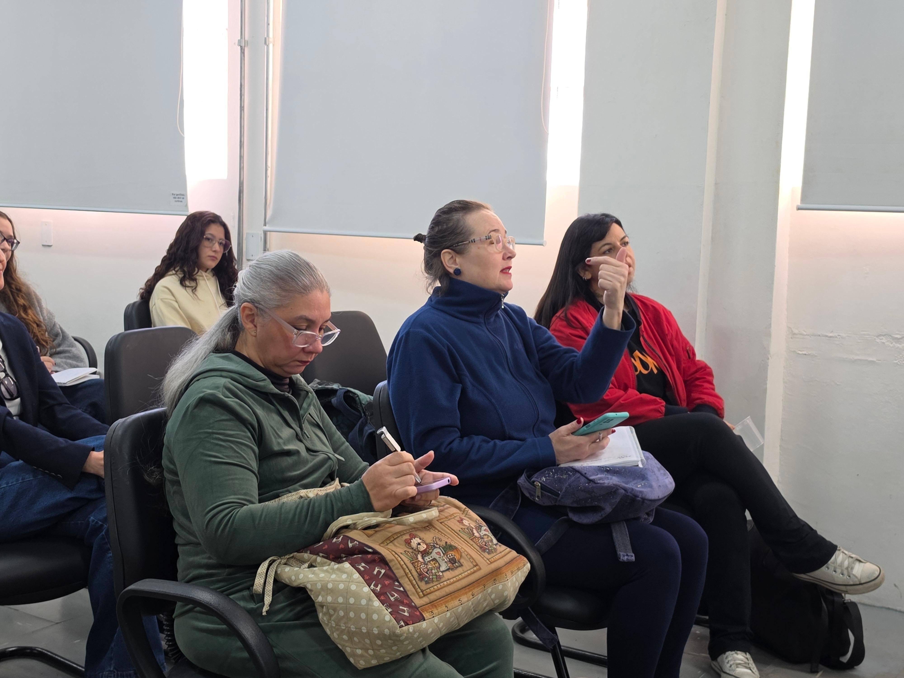

# Práticas Extensionistas na Educação em Computação - Relatório individual

### 1. Identificação

**Nome:** Ana Lilian Alfonso Toledo

**Projeto:** Desenvolvimento de um site para divulgação dos catálogos dos empreendimentos incubados pelo Hub Incubadora Social

### 2. Introdução

A disciplina de Práticas Extensionistas na Educação em Computação teve um impacto diferente para mim em comparação com outras disciplinas do curso. Em muitas disciplinas, mesmo quando temos atividades práticas, os problemas acabam ficando mais restritos ao ambiente acadêmico. Nesta disciplina, senti que o trabalho tinha outra dimensão, porque estávamos desenvolvendo algo que poderia ser usado por pessoas reais, em um contexto real e com uma necessidade concreta.

Ao longo do semestre, trabalhamos no desenvolvimento de um site para o Hub Incubadora Social, com o objetivo de divulgar os produtos e serviços dos empreendimentos incubados. A ideia era criar uma vitrine digital que pudesse ajudar esses empreendedores a terem mais visibilidade e facilitar o acesso do público às informações sobre seus negócios.

Antes dessa disciplina, eu ainda não tinha muita noção de como era participar de um projeto de software com impacto social direto. Já tinha feito trabalhos em grupo e projetos de programação, mas essa experiência foi diferente porque envolveu diálogo com pessoas de fora da Computação, levantamento de necessidades reais, adaptação constante da proposta e preocupação com o uso futuro da solução.

Mais do que desenvolver um site, a disciplina me fez perceber que a Computação pode ter um papel importante fora da nossa rotina de aulas, provas e trabalhos. Ela pode ser uma forma de apoiar iniciativas sociais, aproximar a universidade da comunidade e contribuir, mesmo que aos poucos, para melhorar a realidade de outras pessoas.

### 3. Atividades realizadas e minhas contribuições

Durante o semestre, participei de diferentes etapas do projeto. Como a proposta deste relatório é ser mais reflexiva, apresento as atividades de forma resumida, destacando principalmente as minhas contribuições individuais:

* Participei das discussões iniciais sobre a disciplina, a extensão universitária e os 5 Is da extensão.
* Estive presente nas visitas ao Hub Incubadora Social, onde pudemos conhecer melhor o contexto do projeto e entender as demandas apresentadas.
* Contribuí nas discussões sobre a proposta do site, os públicos-alvo e os requisitos iniciais do sistema.
* Participei da construção e análise dos protótipos feitos no Figma, pensando principalmente na organização das telas, na usabilidade e na adequação ao público que iria utilizar o sistema.
* Atuei mais diretamente na parte de front-end, criando novas funcionalidades, ajustando telas e contribuindo para melhorar o design e a experiência de uso.
* Participei da implementação do sistema, ajudando a transformar o que estava no protótipo em uma versão funcional do site.
* Fui uma das encarregadas de apresentar o projeto tanto para o pessoal do Hub quanto para os empreendedores incubados.
* Participei dos momentos de validação com os usuários, observando dúvidas, sugestões e pontos que poderiam ser melhorados.
* Contribuí na etapa de ajustes após os feedbacks recebidos, principalmente pensando em como melhorar a interface e tornar o sistema mais claro.

Ao longo do projeto, foi interessante perceber como cada pessoa do grupo foi assumindo um papel próprio. No meu caso, acabei ficando mais envolvida com o front-end. Isso foi muito positivo, porque pude aprender mais sobre desenvolvimento de interface, organização visual e boas práticas de programação.

### 4. Avaliação auto-reflexiva da experiência

Uma das coisas que mais me marcou nesta disciplina foi perceber que um projeto como esse nunca está realmente “fechado”. Ao longo das reuniões, visitas e apresentações, sempre surgiam novos requisitos ou ajustes em requisitos antigos. Às vezes, a gente achava que já não tinha mais tanta coisa para modificar, mas depois de conversar com alguém ou testar alguma funcionalidade, aparecia mais um detalhe importante.

Isso me fez entender melhor que desenvolver software para um contexto real é muito diferente de desenvolver apenas para cumprir uma atividade da disciplina. Quando existem usuários reais envolvidos, o projeto precisa se adaptar. Ele muda porque as necessidades ficam mais claras com o tempo, porque as pessoas dão feedbacks, porque algumas ideias que pareciam boas no início precisam ser ajustadas e porque o próprio grupo vai entendendo melhor o problema.

Outro ponto muito importante foi o trabalho em grupo. Foi interessante ver como cada integrante contribuiu de uma forma diferente. Algumas pessoas ficaram mais ligadas ao back-end, outras aos testes, outras ao design e ao front-end. Essa divisão ajudou bastante, mas também mostrou que dividir tarefas não significa trabalhar separadamente. Pelo contrário, quanto mais o projeto crescia, mais necessário era conversar, combinar decisões e alinhar o que estava sendo feito.

No meu caso, considero que aprendi bastante tecnicamente. Trabalhar no front-end me ajudou a melhorar minha forma de pensar a interface, a organização das informações e a experiência de quem vai usar o sistema. Também aprendi sobre a importância de pensar em um site que seja bonito, mas principalmente simples, claro e fácil de usar. Isso é ainda mais importante quando estamos desenvolvendo para pessoas que podem não ter tanta familiaridade com tecnologia.

Mas acredito que o aprendizado mais importante foi além da parte técnica. A disciplina me fez sair um pouco da nossa “bolha” do CT e entrar em contato com pessoas de outras áreas e com outras realidades. Conversar com o pessoal do Hub, com os empreendedores e também com pessoas do Desenho Industrial mostrou que a Computação não deve ser pensada sozinha. Um sistema pode até funcionar tecnicamente, mas, para ele realmente ser útil, precisa fazer sentido para quem vai usar.

Também foi uma experiência muito boa participar das apresentações para o Hub e para os empreendedores. Esses momentos exigiram uma preocupação diferente: não bastava explicar o sistema de forma técnica. Era preciso apresentar a proposta de um jeito claro, acessível e próximo das pessoas. Isso me fez perceber como a comunicação é uma parte muito importante do trabalho, especialmente em projetos extensionistas.

Fiquei muito feliz em pensar que o que desenvolvemos na disciplina poderá ser usado pelos empreendedores incubados e servir de apoio para eles. Isso torna o trabalho mais significativo. Não foi apenas mais um projeto para entregar no final do semestre, mas algo que pode ter continuidade e impacto real na sociedade.

### 5. Reflexão sobre os 5 Is da extensão

Os 5 Is da extensão, apresentados no primeiro dia de aula, acompanharam todo o desenvolvimento do projeto. No começo, eles pareciam mais conceitos teóricos da disciplina, mas, com o passar do semestre, fui percebendo como eles apareciam na prática.

#### Interação dialógica

A interação dialógica esteve presente principalmente nos momentos de conversa com o Hub e com os empreendedores. O projeto não foi construído apenas a partir da nossa visão como estudantes de Computação. Pelo contrário, ele precisou ser pensado a partir da escuta das pessoas envolvidas.

Esse diálogo foi importante porque nos ajudou a entender melhor o que realmente fazia sentido para o público do projeto. Algumas decisões de interface, organização ou funcionalidade só ficaram mais claras depois dessas conversas. Isso mostrou que ouvir o usuário não é uma etapa secundária, mas uma parte central do desenvolvimento.

#### Impacto social

O impacto social do projeto está relacionado à possibilidade de apoiar os empreendimentos incubados na divulgação de seus produtos e serviços. Muitos desses empreendedores precisam de mais visibilidade e nem sempre possuem acesso fácil a ferramentas digitais próprias. Nesse sentido, o site pode funcionar como uma vitrine coletiva, ajudando a aproximar os empreendedores de possíveis clientes.

Para mim, esse foi um dos pontos mais importantes da disciplina. Saber que o sistema pode ser utilizado de verdade e que pode contribuir, mesmo que de forma simples, para fortalecer esses empreendimentos dá outro sentido ao trabalho realizado.

#### Impacto na formação

A disciplina teve um impacto grande na minha formação. Aprendi conteúdos técnicos, principalmente relacionados ao desenvolvimento front-end, mas também aprendi muito sobre colaboração, responsabilidade, comunicação e adaptação.

Acredito que essa experiência contribuiu para minha formação como estudante e também como futura profissional. Ela mostrou que desenvolver tecnologia não é apenas escrever código. É também entender o contexto, conversar com as pessoas, perceber limitações, aceitar feedbacks e buscar soluções que sejam realmente úteis.

#### Interdisciplinaridade

A interdisciplinaridade, mesmo sendo o ponto mais fraco do nosso projeto na minha opinião, também esteve presente. As reuniões e trocas com o pessoal do Hub, com os empreendedores e com o Desenho Industrial mostraram que diferentes olhares ajudam a melhorar muito o projeto.

A Computação foi essencial para construir o sistema, mas outras áreas ajudaram a pensar melhor a comunicação visual, a experiência do usuário e a forma como as informações deveriam ser apresentadas. Isso deixou claro que problemas reais dificilmente são resolvidos por uma única área do conhecimento.

#### Indissociabilidade entre ensino, pesquisa e extensão

A indissociabilidade entre ensino, pesquisa e extensão também apareceu durante o projeto. O ensino esteve presente no aprendizado de conceitos, ferramentas e práticas de desenvolvimento, incluindo o uso do Clarity, uma ferramenta que não conhecíamos e precisamos aprender para pensar no acompanhamento do site. A pesquisa apareceu tanto no início do semestre, quando estudamos outros projetos extensionistas, quanto na busca por soluções e tecnologias para implementar o sistema. Já a extensão esteve presente no contato com a comunidade e na construção de uma solução voltada para uma demanda real.

Essa articulação tornou o aprendizado mais completo, pois aplicamos conhecimentos do curso em um projeto com propósito social.

### 6. O que deu certo, o que poderia melhorar e o que eu faria diferente

Considero que muitos aspectos deram certo ao longo do semestre. O grupo conseguiu transformar uma demanda inicial em um sistema funcional, dialogar com os usuários e ajustar o projeto a partir dos feedbacks recebidos. Também acredito que a divisão de tarefas funcionou bem, porque cada pessoa pôde contribuir mais diretamente em uma parte do desenvolvimento.

Outro ponto positivo foi a abertura do grupo para melhorar o sistema. As visitas e validações mostraram que sempre havia algo que poderia ser ajustado, e isso foi tratado como parte natural do processo. Essa disposição para ouvir e modificar o projeto foi essencial.

Ao mesmo tempo, também percebo algumas lacunas. Do ponto de vista do projeto, acho que poderíamos ter tido mais momentos de teste com os usuários. Cada vez que alguém de fora do grupo usava o sistema, surgiam observações importantes. Além disso, considero que poderiam ter ocorrido mais encontros com os empreendedores para ensinar o uso do site, já que eles são os principais usuários e serão fundamentais para que a plataforma seja realmente utilizada. Por isso, mais rodadas de validação e orientação poderiam ter ajudado a identificar problemas antes e a deixar o site mais adequado ao público.

Da minha parte, considero que um ponto que posso melhorar é a comunicação. Tenho uma personalidade mais introspectiva e, em alguns momentos, acho que poderia ter participado mais ativamente das discussões ou compartilhado minhas dúvidas e ideias com mais frequência. Mesmo assim, essa disciplina me ajudou a perceber a importância dessa habilidade. A comunicação é essencial não só para projetos extensionistas, mas também para o trabalho em equipe, para a vida acadêmica e para a atuação profissional.

### 7. Considerações finais

Participar da disciplina de Práticas Extensionistas na Educação em Computação foi uma experiência muito significativa para mim. Ela se diferenciou das demais disciplinas porque nos colocou em contato com uma demanda real, com pessoas reais e com a possibilidade de gerar um impacto concreto fora da universidade.

Ao longo do semestre, aprendi que desenvolver software não é apenas implementar funcionalidades. É também escutar, adaptar, dialogar, testar, errar, corrigir e melhorar. A experiência com o Hub Incubadora Social mostrou que a Computação pode ser uma ferramenta importante de apoio à inclusão, à divulgação de iniciativas sociais e ao fortalecimento de pequenos empreendimentos.

Também considero que sair da nossa rotina dentro do Centro de Tecnologia foi muito importante. Esse contato com outros contextos me ajudou a crescer como pessoa e como futura profissional. Acredito que experiências como essa são essenciais para a formação dos alunos, porque mostram que o conhecimento produzido na universidade pode e deve dialogar com a sociedade.

Por fim, só tenho a agradecer à professora pela orientação durante todo o semestre, sempre nos ajudando, incentivando e nos impulsionando a melhorar um pouco mais. Também agradeço aos meus colegas pela parceria e pelo trabalho em equipe. Acredito que todos contribuíram bastante e que conseguimos construir um projeto muito importante.

Obrigada a todos :)

---

## Momentos para recordar

  
  

  
  

  
  

  
  

