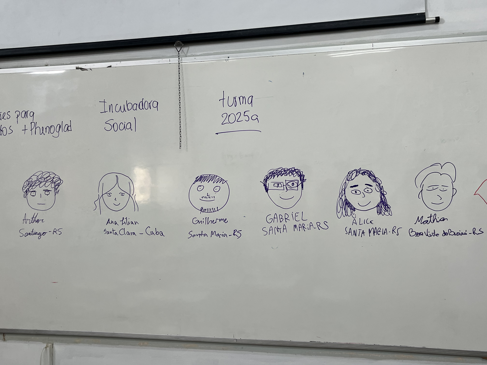
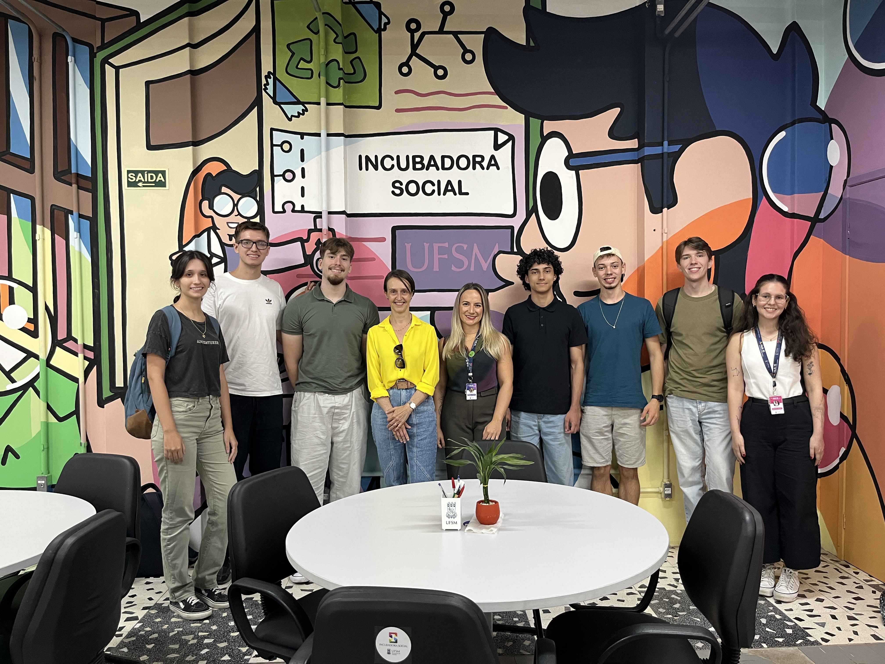
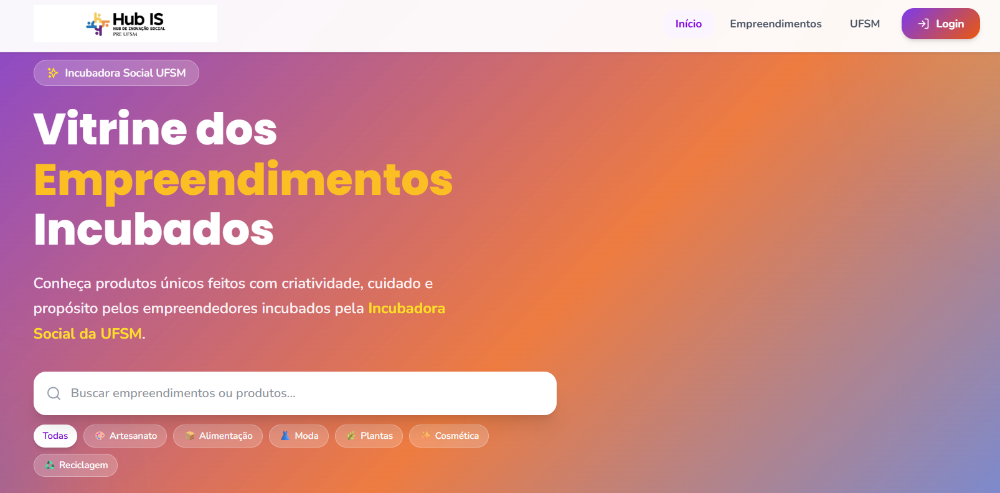
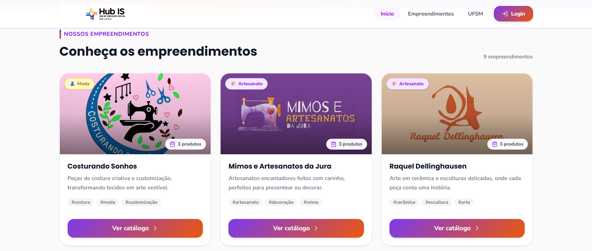
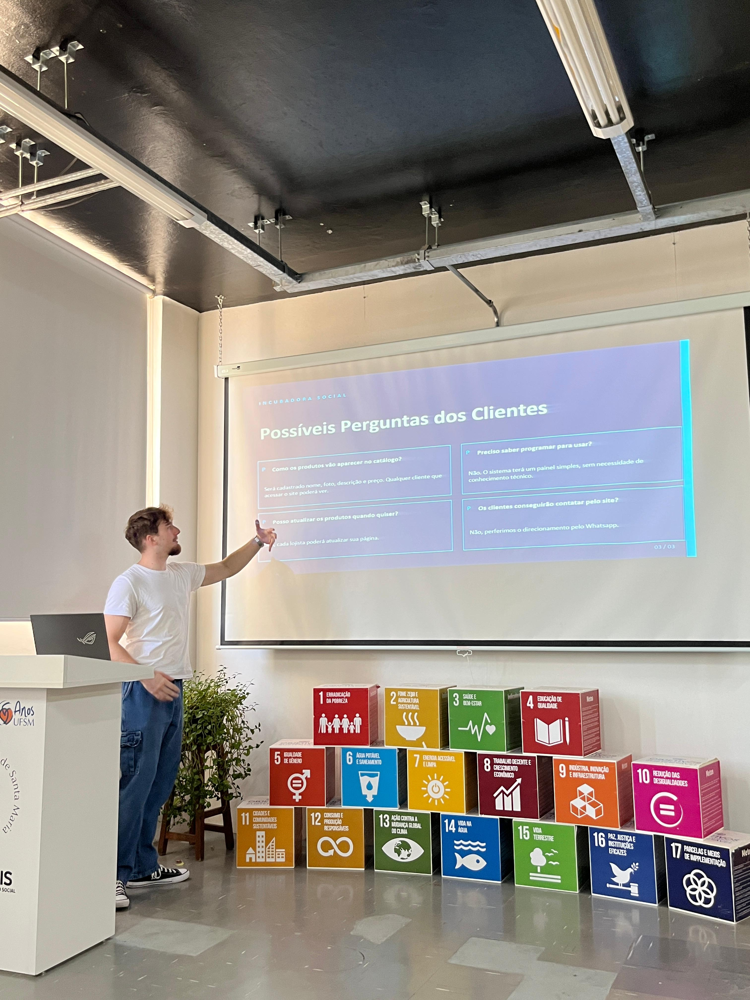

# Práticas Extensionistas na Educação em Computação

Este repositório tem como objetivo registrar as atividades desenvolvidas por mim na disciplina **Práticas Extensionistas na Educação em Computação**. Aqui serão descritas, de forma organizada, as ações realizadas ao longo do semestre, incluindo estudos, debates, visitas técnicas, identificação de demandas sociais e possíveis soluções computacionais voltadas à comunidade.

A proposta da disciplina envolve aproximar a área da Computação das necessidades reais da sociedade, promovendo uma formação mais humana, crítica e comprometida com o desenvolvimento social. Nesse contexto, as atividades realizadas até o momento têm contribuído para a compreensão do papel da extensão universitária como ponte entre universidade e comunidade.

---

## Atividades desenvolvidas

## 1ª semana

### Introdução à disciplina e apresentação
Na primeira semana foi realizada a apresentação da disciplina, de sua proposta pedagógica e de seus objetivos. Nesse momento, foi possível compreender que a disciplina está voltada à articulação entre universidade e sociedade, buscando desenvolver ações extensionistas que utilizem conhecimentos da Computação para atender demandas sociais concretas.

Além da apresentação geral da disciplina, também foram introduzidos os conceitos dos **5 Is** que orientam os projetos de extensão e ajudam a compreender os principais critérios que caracterizam uma ação extensionista de qualidade:

- **Interação dialógica**: refere-se à construção de uma relação de troca entre universidade e comunidade, baseada na escuta, no diálogo e na valorização mútua de saberes.
- **Impacto social**: diz respeito à capacidade das ações extensionistas de gerar contribuições concretas e relevantes para a sociedade.
- **Impacto na formação**: relaciona-se à importância da extensão na formação acadêmica e cidadã dos estudantes, ampliando sua visão crítica e seu compromisso social.
- **Interdisciplinaridade**: destaca a integração entre diferentes áreas do conhecimento para compreender melhor os problemas e construir soluções mais completas.
- **Indissociabilidade entre ensino, pesquisa e extensão**: reforça que a extensão universitária não deve estar separada das demais dimensões da universidade, mas articulada ao ensino e à pesquisa.

Essa introdução foi importante para estabelecer as bases conceituais da disciplina e para compreender que a extensão universitária vai além da aplicação de conhecimentos técnicos, envolvendo também escuta ativa, responsabilidade social e formação integral.

### Pesquisa para debate em aula: Projeto **Flores para Todos (PhenoGlad)**
Como atividade inicial, foi realizada uma pesquisa sobre o projeto **Flores para Todos (PhenoGlad)** para subsidiar um debate em aula.

O projeto tem como objetivo levar conhecimentos sobre **floricultura** para escolas e comunidades do interior, promovendo a aprendizagem sobre o cultivo de flores e incentivando essa prática como uma possível fonte de geração de renda para famílias. A iniciativa possui relevância social por articular educação, produção local e desenvolvimento comunitário, oferecendo novas possibilidades econômicas para públicos que muitas vezes possuem acesso limitado a oportunidades de capacitação e inovação.

Além do aspecto produtivo, o projeto também apresenta caráter educativo, uma vez que aproxima estudantes e comunidades de conhecimentos práticos e científicos relacionados ao plantio, manejo e cuidado com flores. Dessa forma, o **Flores para Todos** contribui tanto para a formação quanto para o fortalecimento da autonomia das comunidades envolvidas.

A pesquisa e o debate em aula permitiram refletir sobre como projetos extensionistas podem impactar positivamente a realidade local, especialmente quando valorizam saberes regionais e estimulam alternativas sustentáveis de trabalho e renda.

---

## 2ª semana

### Apresentação do GitHub da turma e orientações de registro
Na segunda semana, foi apresentado o **GitHub da turma**, bem como as orientações para o preenchimento dos relatórios nas pastas individuais. Essa atividade teve como finalidade organizar o registro das ações desenvolvidas na disciplina, além de incentivar o uso de ferramentas tecnológicas para documentação e acompanhamento das atividades extensionistas.

O uso do GitHub também contribui para o desenvolvimento de competências importantes na área da Computação, como organização de projetos, escrita técnica, versionamento e registro sistemático de atividades.

### Visita ao **Hub Incubadora Social**

Também foi realizada uma visita ao **Hub Incubadora Social**, com o objetivo de conhecer o programa, entender sua proposta de atuação e identificar necessidades que possam ser atendidas por meio de soluções na área da Computação.

O programa tem como principal objetivo apoiar **pequenos negócios e empreendimentos com caráter social**, auxiliando no seu desenvolvimento e fortalecimento no mercado. Em muitos casos, os empreendimentos incubados são formados por pessoas em situação de vulnerabilidade socioeconômica, com **baixa renda** e **acesso limitado a tecnologias digitais**, o que pode dificultar sua divulgação, crescimento e competitividade.

A visita permitiu perceber que a incubadora exerce um papel importante no apoio a esses grupos, promovendo inclusão produtiva, autonomia e valorização do trabalho local. Além disso, foi possível identificar uma demanda concreta que pode ser trabalhada pela turma: a criação de um **site para divulgação de catálogos dos produtos ofertados pelos empreendimentos incubados**.

Essa possível solução computacional pode contribuir para ampliar a visibilidade dos produtos, facilitar o acesso de clientes às informações e fortalecer a presença digital dos empreendimentos. Dessa forma, a atividade evidenciou como a Computação pode ser aplicada de maneira prática e socialmente relevante, colaborando com iniciativas de impacto comunitário.

---

## 3ª semana

### Discussão da Proposta e Definição dos Requisitos do Projeto

Na terceira semana da disciplina, foi realizada inicialmente uma discussão sobre a visita à incubadora social e sobre as principais impressões a respeito do projeto que nos foi apresentado. Nesse momento, foram analisadas a viabilidade e a relevância da proposta de implementação recebida pelo grupo, que consiste na criação de um site para a divulgação dos catálogos das empresas incubadas.

Ao longo da discussão, também foram definidos os principais públicos-alvo do sistema: os trabalhadores da incubadora social, que ficarão responsáveis pela administração do site; os empreendedores incubados, que terão seus empreendimentos divulgados na plataforma; e os usuários interessados, que acessarão o site para visualizar os catálogos e conhecer os produtos e serviços oferecidos.

Outro ponto importante levantado foi a **necessidade de que o sistema seja simples, intuitivo e de fácil utilização**. Esse aspecto foi considerado essencial para atender adequadamente aos empreendedores incubados, tendo em vista que muitos deles não possuem conhecimento tecnológico aprofundado. Assim, desde o início do planejamento, buscou-se considerar a acessibilidade e a usabilidade como características centrais da proposta.

Em um segundo momento, foram discutidos conjuntamente diversos requisitos do sistema, com o objetivo de alinhar o desenvolvimento do projeto às demandas identificadas anteriormente. Além disso, foram definidas algumas tarefas iniciais para dar início à construção da solução, entre elas a elaboração de um protótipo no Figma, para apresentar a estruturação do site, e a coleta de informações sobre os empreendimentos incubados, com a finalidade de formar uma base de dados inicial para ser incorporada ao sistema.

---

## 4ª semana

### Desenvolvimento, avaliação e integração dos protótipos no Figma

Na quarta semana, foram entregues os protótipos do projeto desenvolvidos no Figma, sendo apresentadas duas propostas distintas de interface. A partir disso, foi realizada uma análise comparativa entre os dois protótipos, considerando os requisitos levantados nas etapas anteriores e as necessidades identificadas junto ao contexto do projeto.

Durante a discussão, foram observados os pontos positivos e negativos de cada proposta, tanto em relação à organização das informações quanto à usabilidade e à adequação ao público-alvo. Com base nessa avaliação, decidiu-se realizar um *merge* entre os protótipos, reunindo em uma única versão as características mais adequadas e vantajosas de cada um. Esse processo contribuiu para o refinamento da solução proposta, tornando o modelo mais alinhado aos objetivos do sistema.

  
  

---

## 5ª semana

### Apresentação do protótipo no Hub Incubadora Social e validação da proposta

Na quinta semana, foi realizada uma visita ao Hub Incubadora Social com o objetivo de apresentar o modelo do projeto elaborado no Figma. Essa atividade teve como finalidade obter feedback dos trabalhadores envolvidos, verificar se o protótipo estava de acordo com a proposta esperada e esclarecer dúvidas relacionadas ao funcionamento e à estrutura do sistema.

De modo geral, o protótipo foi bem aceito pelos participantes, que demonstraram satisfação com a proposta apresentada. Foram levantadas apenas pequenas sugestões de ajuste, voltadas principalmente ao aprimoramento de alguns detalhes do modelo. A visita foi importante para validar o encaminhamento do projeto e confirmar que a solução desenvolvida estava coerente com as expectativas dos interessados.

  
  

